---
## Front matter
lang: ru-RU
title: Презентация к индивидуальному проекту
subtitle:
author:
  - Ромицына Анастасия Романовна
institute:
  - Российский университет дружбы народов, Москва, Россия
date: 01.03.24

## i18n babel
babel-lang: russian
babel-otherlangs: english

## Formatting pdf
toc: false
toc-title: Содержание
slide_level: 2
aspectratio: 169
section-titles: true
theme: metropolis
header-includes:
 - \metroset{progressbar=frametitle,sectionpage=progressbar,numbering=fraction}
 - '\makeatletter'
 - '\beamer@ignorenonframefalse'
 - '\makeatother'
 
## Fonts
mainfont: PT Serif
romanfont: PT Serif
sansfont: PT Sans
monofont: PT Mono
mainfontoptions: Ligatures=TeX
romanfontoptions: Ligatures=TeX
sansfontoptions: Ligatures=TeX,Scale=MatchLowercase
monofontoptions: Scale=MatchLowercase,Scale=0.9
---

# Информация

## Докладчик

:::::::::::::: {.columns align=center}
::: {.column width="70%"}

  * Ромицына Анастасия Романовна
  * НПИбд-02-23 студ.билет:1132236132
  * Российский университет дружбы народов
	1132236132@pfur.ru

:::
::: {.column width="30%"}

:::
::::::::::::::

# Вводная часть

## Цели и задачи
Научиться создавать сайты с помощью Hugo и размещать их на хостинге github.

## Задание
Установить необходимое программное обеспечение.
Скачать шаблон темы сайта.
Разместить его на хостинге git.
Установить параметр для URLs сайта.
Разместить заготовку сайта на Github pages

## Скачивание движка
Скачаем последнюю версию движка сайтов hugo для OC Linux

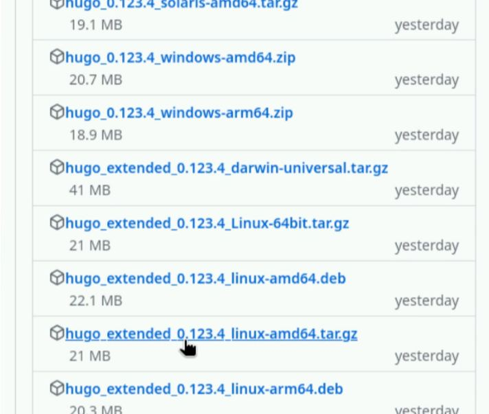
:::

## Распаковка Hugo
С помощью утилиты tar распакуем архив

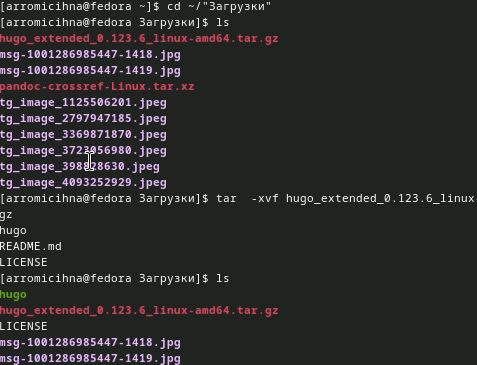
:::

## Установка Hugo
Установим Hugo, переместив файл в нужную директорию

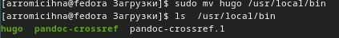
:::

## Создание репозитория шаблона
Зайдем на страницу шаблона для сайта и создадим из нее репозиторий

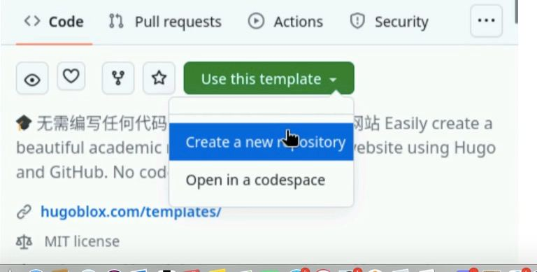
:::

## Имя репозитория
Назовем репозиторий

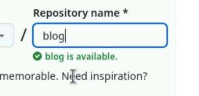
:::

## Клонирование
Клонируем созданный репозиторий к себе на компьютер

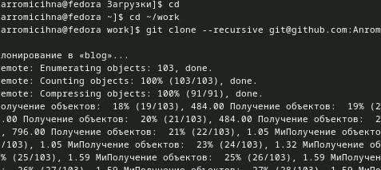
:::

## Установка go
Установим язык go на виртуальную машину

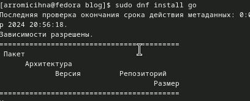
:::

## Запуск hugo
Запустим hugo с опцией server, она позволит нам запустить наш сайт

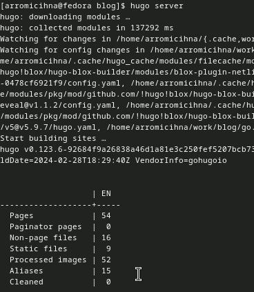
:::

## Открытие сайта
Перейдем по ссылке и откроем наш сайт

:::

## Создание репозитория
Создадим новый репозиторий, на котором будет наш сайт

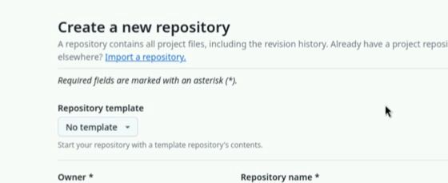
:::

## Клонирование репозитория
Клонируем наш пустой репозиторий на компьютер и создадим нужный файл

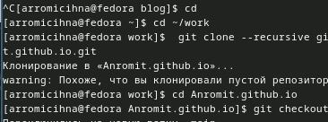
:::

## Обновление репозитория
Обновляем репозиторий, выкладываем изменения

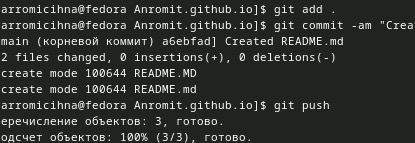
:::

## Устранение ошибок
Открываем файл и закомментируем папку public

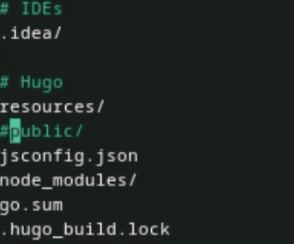
:::

## Добавление репозитория
Теперь добавим второй репозиторий как сабмодуль первого, и он будет хранит папку public

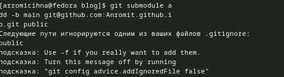
:::

## Проверка
Проверим корректность настройки сабмодуля

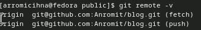
:::

## Commit
Сделаем коммит

:::

## Загрузка изменений
Выгружаем все изменения на гитхаб

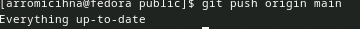
:::

## Просмотри сайта
Посмотрим как выглядит наш сайт

:::

