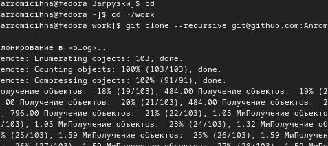

---
## Front matter
title: "Отчет по индивидуальному проекту"
subtitle: "Этап 1"
author: "Ромицына Анастасия Романовна"

## Generic otions
lang: ru-RU
toc-title: "Содержание"

## Bibliography
bibliography: bib/cite.bib
csl: pandoc/csl/gost-r-7-0-5-2008-numeric.csl

## Pdf output format
toc: true # Table of contents
toc-depth: 2
lof: true # List of figures
lot: true # List of tables
fontsize: 12pt
linestretch: 1.5
papersize: a4
documentclass: scrreprt
## I18n polyglossia
polyglossia-lang:
  name: russian
  options:
	- spelling=modern
	- babelshorthands=true
polyglossia-otherlangs:
  name: english
## I18n babel
babel-lang: russian
babel-otherlangs: english
## Fonts
mainfont: PT Serif
romanfont: PT Serif
sansfont: PT Sans
monofont: PT Mono
mainfontoptions: Ligatures=TeX
romanfontoptions: Ligatures=TeX
sansfontoptions: Ligatures=TeX,Scale=MatchLowercase
monofontoptions: Scale=MatchLowercase,Scale=0.9
## Biblatex
biblatex: true
biblio-style: "gost-numeric"
biblatexoptions:
  - parentracker=true
  - backend=biber
  - hyperref=auto
  - language=auto
  - autolang=other*
  - citestyle=gost-numeric
## Pandoc-crossref LaTeX customization
figureTitle: "Рис."
tableTitle: "Таблица"
listingTitle: "Листинг"
lofTitle: "Список иллюстраций"
lotTitle: "Список таблиц"
lolTitle: "Листинги"
## Misc options
indent: true
header-includes:
  - \usepackage{indentfirst}
  - \usepackage{float} # keep figures where there are in the text
  - \floatplacement{figure}{H} # keep figures where there are in the text
---

# Цель работы

Научиться создавать сайты с помощью Hugo и размещать их на хостинге github.

# Задание
Установить необходимое программное обеспечение.
Скачать шаблон темы сайта.
Разместить его на хостинге git.
Установить параметр для URLs сайта.
Разместить заготовку сайта на Github pages

# Выполнение лабораторной работы

Скачаем последнюю версию движка сайтов hugo для OC Linux(рис. [-@fig:001]).

{#fig:001 width=70%}

С помощью утилиты tar распакуем архив(рис. [-@fig:002]).

{#fig:002 width=70%}

Установим Hugo, переместив файл в нужную директорию(рис. [-@fig:003]).

{#fig:003 width=70%}

Зайдем на страницу шаблона для сайта и создадим из нее репозиторий(рис. [-@fig:004]).

{#fig:004 width=70%}

Назовем репозиторий(рис. [-@fig:005]).

{#fig:005 width=70%}

Клонируем созданный репозиторий к себе на компьютер(рис. [-@fig:006]).

{#fig:006 width=70%}

Установим язык go на виртуальную машину(рис. [-@fig:007]).

{#fig:007 width=70%}

Запустим hugo с опцией server, она позволит нам запустить наш сайт(рис. [-@fig:008]).

{#fig:008 width=70%}

Перейдем по ссылке и откроем наш сайт(рис. [-@fig:009]).

{#fig:009 width=70%}

Создадим новый репозиторий, на котором будет наш сайт(рис. [-@fig:010]).

{#fig:010 width=70%}

Клонируем наш пустой репозиторий на компьютер и создадим нужный файл(рис. [-@fig:011]).

{#fig:011 width=70%}

Обновляем репозиторий, выкладываем изменения(рис. [-@fig:012]).

{#fig:012 width=70%}

Открываем файл и закомментируем папку public(рис. [-@fig:013]).

{#fig:013 width=70%}

Теперь добавим второй репозиторий как сабмодуль первого, и он будет хранит папку public(рис. [-@fig:014]).

{#fig:014 width=70%}

Проверим корректность настройки сабмодуля(рис. [-@fig:015]).

{#fig:015 width=70%}

Сделаем коммит(рис. [-@fig:016]).

{#fig:016 width=70%}

Выгружаем все изменения на гитхаб(рис. [-@fig:017]).

{#fig:017 width=70%}

Посмотрим как выглядит наш сайт(рис. [-@fig:018]).

{#fig:018 width=70%}

# Выводы
Мы научились создавать сайты с помощью Hugo и размещать их на хостинге github.

# Список литературы{.unnumbered}

::: {#refs}
:::
