---
## Front matter
lang: ru-RU
title: Отчет по лабораторной работе Linux, дистрибутив Fedora sway на виртуальную машину
subtitle: Установка Операционной системы 
author:
  - Ромицына А.Р.
institute:
  - Российский университет дружбы народов, Москва, Россия
date: 26.02.24

## i18n babel
babel-lang: russian
babel-otherlangs: english

## Formatting pdf
toc: false
toc-title: Содержание
slide_level: 2
aspectratio: 169
section-titles: true
theme: metropolis
header-includes:
 - \metroset{progressbar=frametitle,sectionpage=progressbar,numbering=fraction}
 - '\makeatletter'
 - '\beamer@ignorenonframefalse'
 - '\makeatother'

## Fonts
mainfont: PT Serif
romanfont: PT Serif
sansfont: PT Sans
monofont: PT Mono
mainfontoptions: Ligatures=TeX
romanfontoptions: Ligatures=TeX
sansfontoptions: Ligatures=TeX,Scale=MatchLowercase
monofontoptions: Scale=MatchLowercase,Scale=0.9
---
# Информация

## Докладчик

:::::::::::::: {.columns align=center}
::: {.column width="70%"}

  * Ромицына Анастасия Романовна
  * НПИбд-02-23, студ.билет:1132236132
  * профессор кафедры прикладной информатики и теории вероятностей
  * Российский университет дружбы народов
  * [1132236132@pfur.ru]

:::
::: {.column width="30%"}

:::
::::::::::::::

# Вводная часть

## Цели и задачи

Целью данной работы является приобретение практических навыков установки операционной системы на виртуальную машину, настройки минимально необходимых для дальнейшей работы сервисов.

# Выполнение лабораторной работы

## Создание вертуальной машины
::::::::::::::
-Откроем и создадим новую виртуальную машину
:::
::: {.column width="30%"}
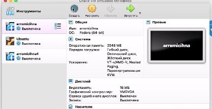
:::
::::::::::::::

## Создание и настройка вертуальной машины
::::::::::::::
-Укажем имя и тип OC
:::
::: {.column width="30%"}
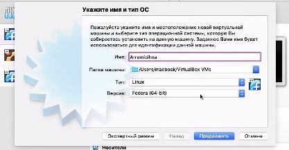
:::
::::::::::::::

## Указание объема памяти
::::::::::::::
-Укажем объем памяти для нашей виртуальной машины.
:::
::: {.column width="30%"}
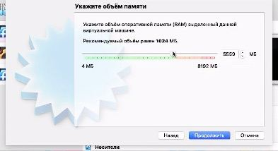
:::
::::::::::::::

## Создание вертуальной машины
::::::::::::::
-Закончив настройку виртуальной машины, выбираем систему Fedora Sway.
:::
::: {.column width="30%"}
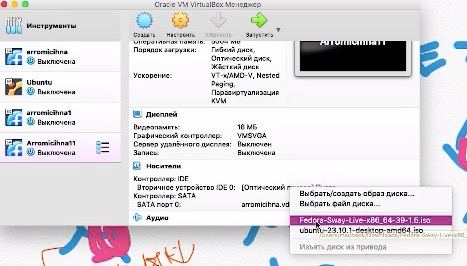
:::
::::::::::::::

## Создание вертулаьной машины
::::::::::::::
-Откроем установщик с помощью сочетания клавиш Win+d, выберем нужный язык.
:::
::: {.column width="30%"}
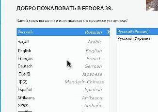
:::
::::::::::::::

## Создание вертулаьной машины
::::::::::::::
-Выберем нужный диск, с достаточным объемом свободной памяьти, запустим установку и после нее выключим виртуальную машину.
:::
::: {.column width="30%"}
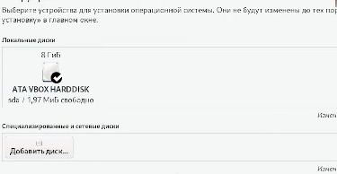
:::
::::::::::::::

## Создание вертуальной машины
::::::::::::::
-Извлечем диск.
:::
::: {.column width="30%"}
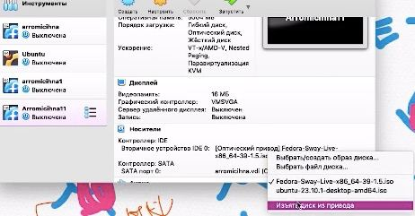
:::
::::::::::::::

## Переход в root
::::::::::::::
-Запустим машину еще раз, откроем терминал, и введем команду полного доступа для установки пакетов.
:::
::: {.column width="30%"}

:::
::::::::::::::

## Установка обновлений
::::::::::::::
-Установим все необходимые обновления обновления.
:::
::: {.column width="30%"}

:::
::::::::::::::

## Установка необходимых файлов
::::::::::::::
-Установим пандок.
:::
::: {.column width="30%"}
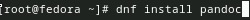
:::
::::::::::::::

##  Установка необходимых файлов
::::::::::::::
-ИУстановим дистрибутив TeXlive.
:::
::: {.column width="30%"}
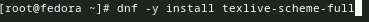
:::
::::::::::::::

## Домашнее задание 1
::::::::::::::
-Версия ядра Linux (Linux version).
:::
::: {.column width="30%"}
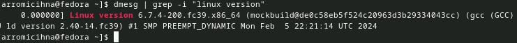
:::
::::::::::::::

## Домашнее задание 2
::::::::::::::
-Частота процессора (Detected Mhz processor).
:::
::: {.column width="30%"}
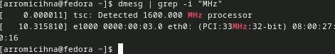
:::
::::::::::::::

## Домашнее задание 3
::::::::::::::
-Модель процессора (CPU0).
:::
::: {.column width="30%"}
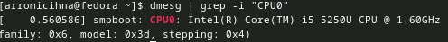
:::
::::::::::::::

## Домашнее задание 4
::::::::::::::
-Объём доступной оперативной памяти (Memory available).
:::
::: {.column width="30%"}
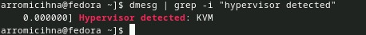
:::
::::::::::::::

## Домашнее задание 5
::::::::::::::
-Тип обнаруженного гипервизора (Hypervisor detected).
:::
::: {.column width="30%"}
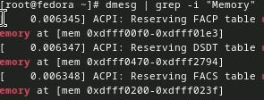
:::
::::::::::::::

## Домашнее задание 6
::::::::::::::
-Тип файловой системы корневого раздела.
:::
::: {.column width="30%"}
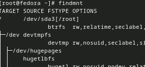
:::
::::::::::::::

## Домашнее задание 7
::::::::::::::
-Последовательность монтирования файловых систем.
:::
::: {.column width="30%"}
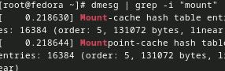
:::
::::::::::::::

##  Вывод
::::::::::::::
-Мы приобрели практические навыки установки операционной системы на виртуальную машину, настройки минимально необходимых для дальнейшей работы сервисов.
::::::::::::::

:::

