---
## Front matter
title: "Отчет по лаюораторной работе 1"
subtitle: ""
author: "Ромицына Анастасия Романовна НПИбд-02-23"

## Generic otions
lang: ru-RU
toc-title: "Содержание"

## Bibliography
bibliography: bib/cite.bib
csl: pandoc/csl/gost-r-7-0-5-2008-numeric.csl

## Pdf output format
toc: true # Table of contents
toc-depth: 2
lof: true # List of figures
lot: true # List of tables
fontsize: 12pt
linestretch: 1.5
papersize: a4
documentclass: scrreprt
## I18n polyglossia
polyglossia-lang:
  name: russian
  options:
	- spelling=modern
	- babelshorthands=true
polyglossia-otherlangs:
  name: english
## I18n babel
babel-lang: russian
babel-otherlangs: english
## Fonts
mainfont: PT Serif
romanfont: PT Serif
sansfont: PT Sans
monofont: PT Mono
mainfontoptions: Ligatures=TeX
romanfontoptions: Ligatures=TeX
sansfontoptions: Ligatures=TeX,Scale=MatchLowercase
monofontoptions: Scale=MatchLowercase,Scale=0.9
## Biblatex
biblatex: true
biblio-style: "gost-numeric"
biblatexoptions:
  - parentracker=true
  - backend=biber
  - hyperref=auto
  - language=auto
  - autolang=other*
  - citestyle=gost-numeric
## Pandoc-crossref LaTeX customization
figureTitle: "Рис."
tableTitle: "Таблица"
listingTitle: "Листинг"
lofTitle: "Список иллюстраций"
lotTitle: "Список таблиц"
lolTitle: "Листинги"
## Misc options
indent: true
header-includes:
  - \usepackage{indentfirst}
  - \usepackage{float} # keep figures where there are in the text
  - \floatplacement{figure}{H} # keep figures where there are in the text
---

# Цель работы

Целью данной работы является приобретение практических навыков установки операционной системы на виртуальную машину, настройки минимально необходимых для дальнейшей работы сервисов.

# Выполнение лабораторной работы

1.Откроем и создадим новую виртуальную машину
(рис. [-@fig:001]).

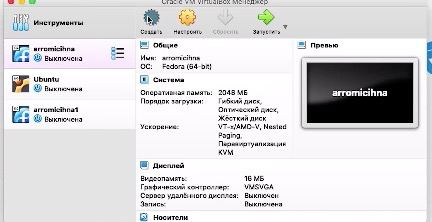{#fig:001 width=70%}

Укажем имя и тип OC.
(рис. [-@fig:002]).

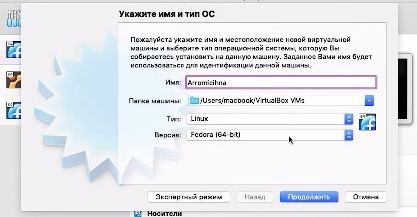{#fig:002 width=70%}

Укажем объем памяти для нашей виртуальной машины.
(рис. [-@fig:003]).

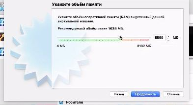{#fig:003 width=70%}

Выберем нужный файл, скаченный заранее.
(рис. [-@fig:004]).

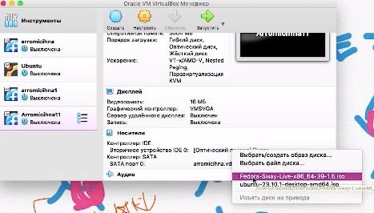{#fig:004 width=70%}

Откроем установщик с помощью сочетания клавиш Win+d, выберем нужный язык.
(рис. [-@fig:005]).

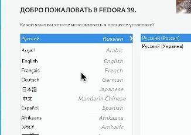{#fig:005 width=70%}

Выберем нужный диск, с достаточным объемом свободной памяьти, запустим установку и после нее выключим виртуальную машину.
(рис. [-@fig:006]).

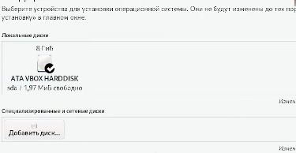{#fig:006 width=70%}

Извлечем диск.
(рис. [-@fig:007]).

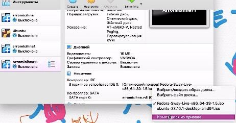{#fig:007 width=70%}

Откроем терминал, и введем команду полного доступа для установки пакетов.
(рис. [-@fig:008]).

{#fig:008 width=70%}

Установим обновления.
(рис. [-@fig:009]).

{#fig:009 width=70%}

Установим пандок.
(рис. [-@fig:010]).

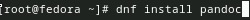{#fig:010 width=70%}

Установим дистрибутив TeXlive.
(рис. [-@fig:011]).

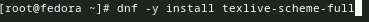{#fig:011 width=70%}

Усановим все остальные настройки для удобной работы с виртуальной машиной и приступим к выполнению домашнего задния

# Домашнее задание

Версия ядра Linux (Linux version).
(рис. [-@fig:012]).

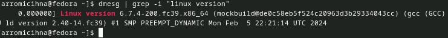{#fig:012 width=70%}

Частота процессора (Detected Mhz processor).
(рис. [-@fig:013]).

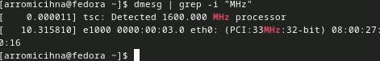{#fig:013 width=70%}

Модель процессора (CPU0).
(рис. [-@fig:014]).

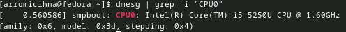{#fig:014 width=70%}

Объём доступной оперативной памяти (Memory available).
(рис. [-@fig:015]).

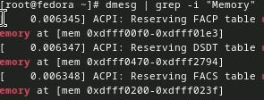{#fig:015 width=70%}

Тип обнаруженного гипервизора (Hypervisor detected).
(рис. [-@fig:016]).

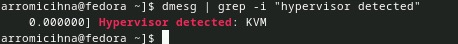{#fig:016 width=70%}

Тип файловой системы корневого раздела.
(рис. [-@fig:017]).

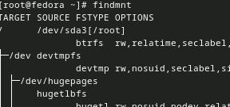{#fig:017 width=70%}

Последовательность монтирования файловых систем.
(рис. [-@fig:018]).

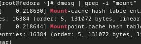{#fig:018 width=70%}

# Выводы

Мы приобрели практические навыки установки операционной системы на виртуальную машину, настройки минимально необходимых для дальнейшей работы сервисов.

# Список литературы{.unnumbered}

::: {#refs}
:::
