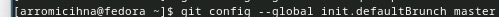
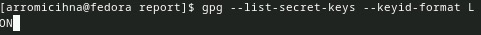

---
## Front matter
lang: ru-RU
title: Презентация к лабораторной работе 3
subtitle: 
author:
  - Ромицына А.Р.
institute:
  - Российский университет дружбы народов, Москва, Россия
date: 28.02.2024
## i18n babel
babel-lang: russian
babel-otherlangs: english

## Formatting pdf
toc: false
toc-title: Содержание
slide_level: 2
aspectratio: 169
section-titles: true
theme: metropolis
header-includes:
 - \metroset{progressbar=frametitle,sectionpage=progressbar,numbering=fraction}
 - '\makeatletter'
 - '\beamer@ignorenonframefalse'
 - '\makeatother'

## Fonts
mainfont: PT Serif
romanfont: PT Serif
sansfont: PT Sans
monofont: PT Mono
mainfontoptions: Ligatures=TeX
romanfontoptions: Ligatures=TeX
sansfontoptions: Ligatures=TeX,Scale=MatchLowercase
monofontoptions: Scale=MatchLowercase,Scale=0.9
---
# Информация

## Докладчик

:::::::::::::: {.columns align=center}
::: {.column width="70%"}

  * Ромицына Анастасия Романовна
  * НПИбд-02-23, студ билет:1132236132
  * Российский университет дружбы народов
 

:::
::: {.column width="30%"}

:::
::::::::::::::
# Вводная часть

## Цели и задачи

Изучить идеологию и применение средств контроля версий.
Освоить умения по работе с git.

##Выполнение лабораторной работы

##Настройка unf-8
-После установки git с помощью команды dnf install git, настраиваем unf-8 в вводе сообщений
:::
:::{.column width="30%"}

:::
::::::::::::::

##Имя ветки
-Зададим имя начальной ветке
:::
:::{.column width="30%"}

:::
::::::::::::::

##Параметры autocfrlf
-Настроим параметры autocfrlf
:::
:::{.column width="30%"}

:::
::::::::::::::

##Параметры safecrlf
-Настроим параметры safecrlf
:::
:::{.column width="30%"}

:::
::::::::::::::

##Создание ssh
-Создадим ключ ssh, скопируем его и введем в наш гит
:::
:::{.column width="30%"}

:::
::::::::::::::

##Подключение git
-Вводим наши данные и заходим в наш репозиторий
:::
:::{.column width="30%"}

:::
::::::::::::::

##Авторизация
-Авторизовываемся в git
:::
:::{.column width="30%"}

:::
::::::::::::::

##Создание каталога
-Создадим необходимые каталоги
:::
:::{.column width="30%"}

:::
::::::::::::::

##Выгрузка на git
-Создадим каталог курса и выгрузим его в наш гит
:::
:::{.column width="30%"}

:::
::::::::::::::

:::
